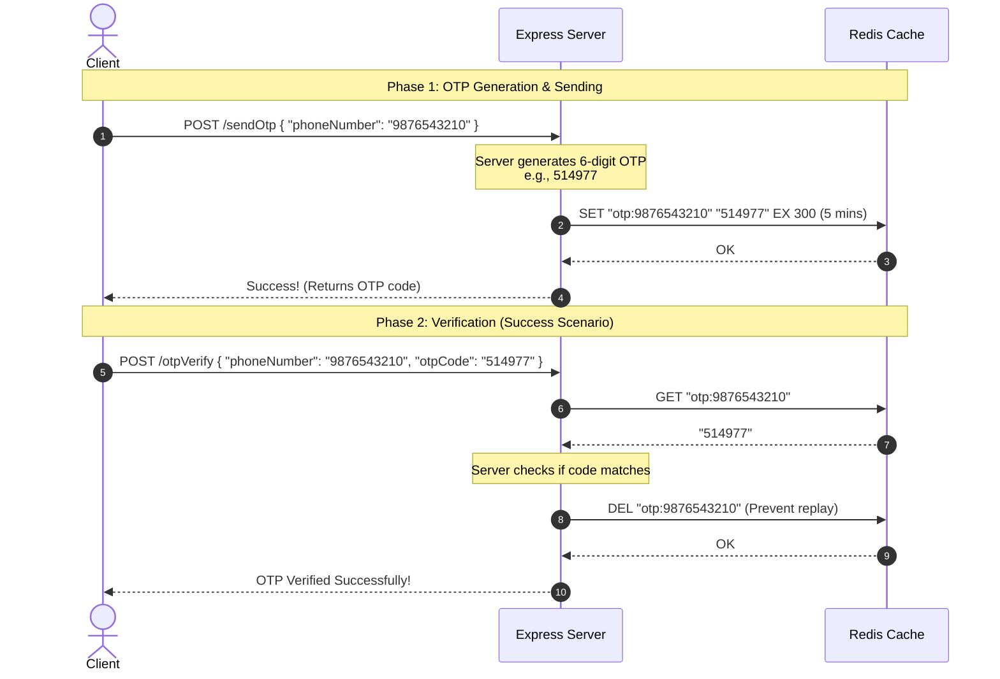

# 🚀 Day 4: OTP Verification in Redis using TTL (Time-To-Live)

Welcome to **Day 4** of the Redis learning journey! 

In Day 3, we learned how to spin up a multi-container environment (Redis + MongoDB) and verify connection status. In **Day 4**, we build a highly practical, real-world feature: **OTP (One-Time Password) Verification** powered by **Redis TTL (Time-To-Live)**.

This project demonstrates how to generate, store, verify, and automatically expire temporary codes in a secure, efficient backend setup.

---

## 💡 What is an OTP with TTL?

For security and resource efficiency, One-Time Passwords (OTPs) should have a short lifespan (e.g., 5 minutes). If a user doesn't verify within this time, the code expires.

### The Role of Redis
Instead of checking timestamps manually in a traditional database, we store the OTP in Redis and set a **TTL (Time-To-Live)**. 
- When we set a TTL, Redis handles the countdown.
- Once the time runs out, Redis **automatically deletes the key**.
- This saves database space and makes security verification incredibly fast since Redis operates in-memory.

---

## 🛠️ Tech Stack & Architecture

This application utilizes:
1. **Express (Node.js)**: A minimal framework to serve REST API endpoints.
2. **Redis (v7-alpine)**: A high-performance, in-memory data store running in a Docker container to store and manage transient OTPs.
3. **MongoDB (v7)**: A NoSQL document database running in a Docker container (preserved for user profiles / persistent storage).
4. **Mongoose**: ODM library for MongoDB connectivity.
5. **ioRedis**: A robust, feature-rich Redis client for Node.js.

### 📁 Codebase Structure
This project uses a clean, modular structure:
- 📄 [src/index.js](./src/index.js) — The entry point containing our API endpoints and application logic.
- 📄 [src/redis/redisClient.js](./src/redis/redisClient.js) — Establishes and exports the Redis connection client.
- 📄 [src/config/otpGenerate.js](./src/config/otpGenerate.js) — Contains the `otp()` function to generate random 6-digit verification codes.
- 📄 [src/config/keyHelperFun.js](./src/config/keyHelperFun.js) — Contains the `otpKey()` helper function to format Redis keys like `otp:phoneNumber` to avoid collisions.
- 📄 [docker-compose.yml](./docker-compose.yml) — Defines the Redis and MongoDB services.

---

## 📋 Prerequisites

Before starting, make sure you have:
*   [Docker Desktop](https://www.docker.com/products/docker-desktop/) (to run Redis & MongoDB)
*   [Node.js](https://nodejs.org/) (v18+)
*   An API Client like Postman, Bruno, or `curl` in your terminal

---

## 🚀 Getting Started

### Step 1: Install Dependencies
Navigate to this directory in your terminal and install packages:
```bash
npm install
```

### Step 2: Spin Up Database Containers
Start Redis and MongoDB in detached mode so they run in the background:
```bash
docker compose up -d
```
> [!NOTE]
> - **Redis** maps to host port `6379` and has AOF persistence enabled.
> - **MongoDB** maps to port `27017` and persists data to a Docker volume.

### Step 3: Run the Server
Launch the Express development server:
```bash
npm run dev
```
The server will start listening on [http://localhost:3000](http://localhost:3000).

---

## 🔄 The OTP Lifecycle Flow

Here is how the verification logic flows between the Client, Express Server, and Redis:



---

## 💡 Redis Operations Explained

In this project, we use key commands to manage the lifecycle of the OTP:

### 1. `SET` with expiration (`EX`)
*   **Command**: `await redis.set(key, value, 'EX', seconds)`
*   **How it works**: Stores a string value under a key and starts a timer. Once the timer ends, Redis automatically removes the key.
*   **Code Reference**: Used in `/sendOtp` to store the OTP with a 5-minute (300 seconds) expiration:
    ```javascript
    await redis.set(otpKey(phoneNumber), otpCode, 'EX', 300);
    ```

### 2. `GET`
*   **Command**: `await redis.get(key)`
*   **How it works**: Fetches the stored value. Returns `null` if the key does not exist or has expired.
*   **Code Reference**: Used in `/otpVerify` to retrieve the active OTP code for validation.

### 3. `DEL`
*   **Command**: `await redis.del(key)`
*   **How it works**: Deletes the specified key immediately.
*   **Code Reference**: Used in `/otpVerify` once verification succeeds. Deleting the OTP prevents the user (or an attacker) from reusing the same OTP code.

### 4. `TTL` (Time To Live)
*   **Command**: `await redis.ttl(key)`
*   **How it works**: Returns the remaining time in seconds that the key has before expiring. Returns `-2` if the key doesn't exist/expired, and `-1` if it has no expiration.
*   **Code Reference**: Used in `/otp/:phone/ttl` to query the remaining validity duration.

---

## 🗺️ API Endpoints & Testing Guide

Use the following endpoints to interact with the API:

### 1. Send OTP
Generates a random OTP, stores it in Redis for 300 seconds, and returns it.

*   **Method**: `POST`
*   **Endpoint**: `/sendOtp`
*   **Request Body (JSON)**:
    ```json
    {
      "phoneNumber": "9876543210"
    }
    ```
*   **Test with `curl`**:
    ```bash
    curl -X POST http://localhost:3000/sendOtp \
      -H "Content-Type: application/json" \
      -d "{\"phoneNumber\": \"9876543210\"}"
    ```
*   **Sample Response**:
    ```json
    {
      "success": true,
      "message": "OTP sent successfully!",
      "otpCode": "514977"
    }
    ```

---

### 2. Verify OTP
Verifies the provided OTP code against the one stored in Redis. Deletes the OTP key upon successful match.

*   **Method**: `POST`
*   **Endpoint**: `/otpVerify`
*   **Request Body (JSON)**:
    ```json
    {
      "phoneNumber": "9876543210",
      "otpCode": "514977"
    }
    ```
*   **Test with `curl`**:
    ```bash
    curl -X POST http://localhost:3000/otpVerify \
      -H "Content-Type: application/json" \
      -d "{\"phoneNumber\": \"9876543210\", \"otpCode\": \"514977\"}"
    ```
*   **Success Response**:
    ```json
    {
      "success": true,
      "message": "OTP verified successfully!"
    }
    ```
*   **Expired or Non-existent Response**:
    ```json
    {
      "success": false,
      "message": "OTP not found or expired!"
    }
    ```

---

### 3. Check Remaining OTP Time (TTL)
Queries Redis to check how many seconds are left before the OTP expires.

*   **Method**: `GET`
*   **Endpoint**: `/otp/:phone/ttl` (Replace `:phone` with the user's phone number)
*   **Test with `curl`**:
    ```bash
    curl http://localhost:3000/otp/9876543210/ttl
    ```
*   **Sample Response (Active OTP)**:
    ```json
    {
      "success": true,
      "message": "OTP TTL fetched successfully!",
      "ttl": 248
    }
    ```

---

### 4. Connection Utility Endpoints
Check connection statuses:
- **Redis Ping (`GET /redis`)**: Returns `{"redis": "PONG"}` to test your Redis connection.
- **MongoDB Connection (`GET /mongo`)**: Connects and checks MongoDB state.
- **Health Check (`GET /health`)**: Verifies Express server status.

---

## 🧹 Cleaning Up

To stop containers and release resources:
```bash
# Stop containers
docker compose down

# Stop containers and destroy volumes (wipes database data/caches)
docker compose down -v
```

---

## 🎯 Key Takeaways for Day 4
*   **Temporal Key Caching**: Setting expiration periods directly inside database operations using `EX`.
*   **Security Best Practices**: Automatically cleaning up security tokens upon verification (`DEL`) to avoid replay attacks.
*   **Key Namespacing**: Formatting keys with unique prefixes (e.g. `otp:<phone_number>`) to organize data and prevent conflicts.
